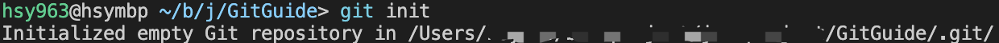

[TOC]

# Git-usage

部分资料参考 https://mp.weixin.qq.com/s/Bf7uVhGiu47uOELjmC5uXQ

有关分支合并内容多做了些补充

# 版本控制

版本控制的意义：多人协同、追踪文件历史、保护源代码、并行开发

常用工具：Git SVN(Subversion) CVS VSS TFS

分类：

- 本地版本控制（RCS） 
- 集中版本控制（都放服务器上，SVN CVS VSS） 
- 分布式版本控制（Git、每台电脑都有）

# Git

## 配置

```shell
git config -l
```


其中用户名和邮箱是必要的设置

```shell
git config --global user.name star
git config --global user.email star@y.com 
```

## 工作流程

四个区域：工作区 暂存区 仓库区 远程仓库（Github Gitee 托管代码的服务器）


工作流程：修改文件 -> 将文件放入暂存区 -> 提交到git仓库


## 常用命令

```shell
# 建一个空工程和空文件
mkdir GitGuide
cd GitGuide
touch test.py
# 初始化，新建git
git init
```



```shell
# 查看文件状态
# 包括未跟踪Untracked 未修改Unmodify 已修改Modified 已暂存Staged
git status
```


```shell
# 放到暂存区
git add .
```

```shell
# 提交 
# -m 提交信息
git commit -m "test"
```


## 忽略文件

```shell
# 新建.gitignore
touch .gitignore 
```

在该文件下添加不想接受版本控制的文件，比如大量的数据、class文件等，格式如下：

```shell
# 为注释
*.txt        #忽略所有 .txt结尾的文件,这样的话上传就不会被选中！
!lib.txt     #但lib.txt除外
/temp        #仅忽略项目根目录下的TODO文件,不包括其它目录temp
build/       #忽略build/目录下的所有文件
doc/*.txt    #会忽略 doc/notes.txt 但不包括 doc/server/arch.txt
```

## 远程

转到github新建一个仓库，然后会有如下提示：


在本地仓库目录下

```shell
# 按提示将当前仓库推到远程
git remote add origin https://github.com/ThinkSYR/GitGuide.git
# 重命名
git branch -M main 
# 在进行推送代码到远端分支，且之后希望持续向该远程分支推送，则可以在推送命令中添加 -u 参数，简化之后的推送命令输入
git push -u origin main
```

在github对应仓库下面就会看到


```shell
# 如果你后面修改了新的文件直接push即可
git push
```

## 分支*

分支，就是管理你代码的多个版本，是git使用的重点

常用分支名字：

master主分支 dev开发用 v1 v2 ...不同版本

```shell
# 列出所有本地分支
git branch
# 列出所有远程分支
git branch -r
# 新建一个分支，但依然停留在当前分支
git branch [branch-name]
# 新建一个分支，并切换到该分支
git checkout -b [branch]
```


### 合并

假设你们团队两个人都修改了同一版本的代码，如果你要合并到新版本，你可以使用分支合并

```shell
# 合并指定分支到当前分支
git merge [branch]
# 删除分支
git branch -d [branch-name]
# 删除远程分支
git push origin --delete [branch-name]
git branch -dr [remote/branch]
```

如果同一个文件在合并分支时都被修改了则会引起冲突：解决的办法是我们可以修改冲突文件后重新提交！选择要保留他的代码还是你的代码！

master主分支应该非常稳定，用来发布新版本，一般情况下不允许在上面工作，工作一般情况下在新建的dev分支上工作，工作完后，比如上要发布，或者说dev分支代码稳定后可以合并到主分支master上来。

除此之外，你还可以用rebase来合并，他们的区别见情况3.

```shell
git rebase [branch]
```

#### 合并情况1

main分支：


从main分支分别创建v0分支和v0.1分支，并且修改文件，如下：

v0分支修改了第三行，v0.1分支修改了第五、六行


将v0分支合并到v0.1分支下，由于文件修改并不冲突，所以自动合并了


#### 合并情况2

还是上面的例子，从main分支再创建一个v0.2分支，并修改文件的第三行


如果这时候把v0分支合并到v0.3分支，由于v0分支也修改了第三行，所以需要处理冲突：


处理冲突只需要手动删除掉多出的两行内容（即```<<<<<<< head``` ```>>>>>>>v0```）,然后保留自己想要的部分就可以了


#### 合并情况3

来看看目前的分支状况（vscode gitgraph插件可以查看），可以看到经过两次合并操作，v0分别合并到了v0.1和v0.2内，如果是大项目管理且有多人协同开发软件，目前这样的merge操作会造成分支异常的紊乱，不太适合开发：


这一次我再从main分支新建一个v1.0分支出来，并且修改了test.py，且新建一个文件test2.py


这时候的分支情况，从main分支多延伸出了一条v1.0


此时，执行rebase分支合并，方便起见，这次我们合并分支v0.2，可以看到test.py产生了冲突需要处理，而test2.py没有


处理完冲突之后提交，此时我们再来查看分支的情况：


可以注意到，v0.2和v1.0出现在了同一条线路上！也就是说，merge操作会让两个分支产生一次交织，而rebase操作会追加到要合并的分支后，假如你的v0.2是已经开发好的功能分支，v1.0还尚未开发完成，可以直接追加到v0.2后面继续开发，此时rebase相比于merge的好处是没有太多的交织，看起来方便些
